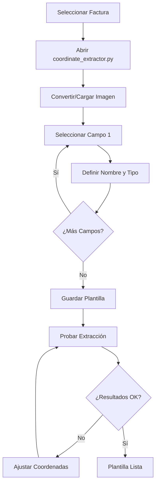

# Tutorial Completo: Cómo Obtener Coordenadas Precisas para Extracción de Datos

## Introducción

Este tutorial te guiará paso a paso para obtener las coordenadas exactas necesarias para extraer datos específicos de tus facturas PDF. Aprenderás a usar la herramienta `coordinate_extractor.py` y a entender cómo funcionan las coordenadas en PDF.

## Tabla de Contenidos

1. [Conceptos Básicos](#conceptos-básicos)
2. [Preparación del Entorno](#preparación-del-entorno)
3. [Tutorial Paso a Paso](#tutorial-paso-a-paso)
4. [Casos Prácticos Detallados](#casos-prácticos-detallados)
5. [Solución de Problemas Comunes](#solución-de-problemas-comunes)
6. [Tips y Mejores Prácticas](#tips-y-mejores-prácticas)
7. [Validación y Pruebas](#validación-y-pruebas)

---

## Conceptos Básicos

### ¿Qué son las Coordenadas en PDF?

Las coordenadas en PDF funcionan como un sistema de mapas para localizar exactamente dónde está cada elemento. Imagina que tu factura PDF es como una hoja de papel cuadriculada:

```
SISTEMA DE COORDENADAS PDF
┌─────────────────────────────────┐ ← (0, altura_página)
│                            │ Y+ │
│         ENCABEZADO          │    │
│                             │    │
│  ┌─────────────┐           │    │
│  │  IMPORTE:   │           │    │   ← Este campo está en
│  │  1.234,56€  │ ←─────────│────│     coordenadas específicas
│  └─────────────┘           │    │
│                             │    │
│         PIE DE PÁGINA       │    │
│                             │    │
│ X+                          │ 0  │
└─────────────────────────────────┘ ← (0, 0) ORIGEN
```

### Diferencias entre Sistemas de Coordenadas

#### PDF vs Imagen - ¡Importante!

| Aspecto | PDF | Imagen (OpenCV) |
|---------|-----|-----------------|
| **Origen (0,0)** | Esquina inferior izquierda | Esquina superior izquierda |
| **Eje Y** | Hacia ARRIBA | Hacia ABAJO |
| **Unidades** | Puntos (72 = 1 pulgada) | Píxeles |
| **Ejemplo Y=100** | 100 puntos desde abajo | 100 píxeles desde arriba |

#### ¿Por qué es Importante?

Cuando seleccionas un área con el ratón en la imagen, las coordenadas están en píxeles y con origen arriba. Pero el PDF usa puntos y origen abajo. **La aplicación hace esta conversión automáticamente**, pero es importante entenderlo para hacer ajustes manuales.

### Formato de Coordenadas

```json
"coordenadas": [x1, y1, x2, y2]
```

Donde:
- **x1, y1**: Esquina superior izquierda del campo
- **x2, y2**: Esquina inferior derecha del campo
- **Unidades**: Puntos PDF (72 puntos = 1 pulgada)

---

## Preparación del Entorno

### Paso 1: Verificar Instalación

```bash
# Navegar al directorio del proyecto
cd extract-pdf-data

# Verificar que las dependencias estén instaladas
python -c "import cv2, pdfplumber, pdf2image; print('Todas las dependencias están instaladas')"
```

### Paso 2: Preparar los Archivos

#### Opción A: Tienes una Imagen de la Factura
Si ya tienes una imagen (PNG, JPG) de tu factura:
```bash
# Copiar imagen a la carpeta correcta
cp mi_factura.png imagenes_muestra/
```

#### Opción B: Tienes el PDF Original
Si tienes el PDF y necesitas convertirlo:
```bash
# La aplicación hará la conversión automáticamente
# Solo asegúrate de que el PDF esté accesible
```

### Paso 3: Crear Directorio de Trabajo

```bash
# Verificar estructura
python main.py verificar
```

Deberías ver:
```
OK Estructura del proyecto verificada correctamente
```

---

## Tutorial Paso a Paso

### Paso 1: Ejecutar el Extractor de Coordenadas

```bash
python coordinate_extractor.py
```

### Paso 2: Seleccionar Método de Entrada

Verás estas opciones:
```
=== EXTRACTOR DE COORDENADAS PARA FACTURAS PDF ===

Opciones:
1. Trabajar con imagen existente
2. Convertir PDF a imagen y trabajar con ella

Selecciona una opción (1 o 2):
```

#### Si Eliges Opción 1: Imagen Existente
```
Ruta de la imagen: imagenes_muestra/mi_factura.png
```

#### Si Eliges Opción 2: Convertir PDF
```
Ruta del PDF: facturas/mi_factura.pdf
Número de página (0 para primera): 0
DPI para conversión (300 recomendado): 300
```

**¿Qué DPI usar?**
- **300 DPI**: Máxima precisión (recomendado)
- **150 DPI**: Buena precisión, archivos más pequeños
- **72 DPI**: Precisión básica, más rápido

### Paso 3: Interface Visual

Se abrirá una ventana mostrando tu factura. Verás estas instrucciones:

```
=== EXTRACTOR DE COORDENADAS ===
INSTRUCCIONES:
1. Clic y arrastra para seleccionar cada campo
2. Ingresa el nombre y tipo del campo en la consola
3. Presiona 'q' para terminar y guardar
4. Presiona 'r' para reiniciar la imagen
5. Presiona 's' para guardar plantilla actual
```

### Paso 4: Seleccionar el Primer Campo

#### 4.1 Identificar el Campo
Mira tu factura y decide qué campo extraer primero. Recomendamos empezar con:
1. **Número de factura** (fácil de localizar)
2. **Total de la factura** (importante)
3. **Fecha** (formato conocido)

#### 4.2 Realizar la Selección
1. **Clic y mantén presionado** en la esquina superior izquierda del campo
2. **Arrastra** hasta la esquina inferior derecha
3. **Suelta** el botón del ratón

#### 4.3 Verificar la Selección
Aparecerá un **rectángulo verde** alrededor del área seleccionada. Si no es correcto:
- Presiona **'r'** para reiniciar
- Vuelve a seleccionar

### Paso 5: Definir el Campo

En la consola verás:
```
--- COORDENADAS EXTRAÍDAS ---
Píxeles (x_min, y_min, x_max, y_max): [450, 120, 650, 140]
PDF (x1, y1, x2, y2): [108.0, 672.0, 156.0, 687.2]

Nombre del campo:
```

#### 5.1 Introducir Nombre
```
Nombre del campo: Numero_Factura
```

**Reglas para nombres:**
- Sin espacios (usar guiones bajos: `_`)
- Solo letras, números y guiones bajos
- Descriptivo: `Total_Factura` no `campo1`

#### 5.2 Definir Tipo
```
Tipo (texto/fecha/numerico): texto
```

**Tipos disponibles:**
- **texto**: Para texto general, números de factura, nombres
- **fecha**: Para fechas en cualquier formato
- **numerico**: Para importes, cantidades, porcentajes

### Paso 6: Continuar con Más Campos

Repite el proceso para cada campo que necesites:

#### Campos Recomendados para Facturas

| Campo | Tipo | Descripción |
|-------|------|-------------|
| `Numero_Factura` | texto | Número único de la factura |
| `Fecha_Factura` | fecha | Fecha de emisión |
| `Total_Factura` | numerico | Importe total |
| `Base_Imponible` | numerico | Base antes de impuestos |
| `IVA` | numerico | Importe del IVA |
| `NIF_Proveedor` | texto | Identificación fiscal |
| `Nombre_Cliente` | texto | Cliente facturado |

### Paso 7: Guardar la Plantilla

Cuando hayas seleccionado todos los campos:

1. **Presiona 'q'** para terminar
2. **Proporciona información del proveedor:**

```
ID del proveedor (ej. PROV_001): PROV_SUMINISTROS_ABC
Nombre del proveedor: Suministros ABC, S.L.
Nombre final de la plantilla: suministros_abc
```

**Resultado:**
```
OK Plantilla guardada exitosamente: plantillas/suministros_abc.json
OK Campos extraídos: 7
```

---

## Casos Prácticos Detallados

### Caso 1: Factura Estándar con Tabla

Supongamos que tienes una factura como esta:

```
    SUMINISTROS ABC, S.L.             Factura: FAC-2024-001
    NIF: B12345678                    Fecha: 15/03/2024

    Cliente: Empresa XYZ

    Descripción              Cantidad    Precio    Importe
    Material de oficina         10       12,50     125,00

                                        Base:     125,00€
                                        IVA 21%:   26,25€
                                        TOTAL:    151,25€
```

#### Orden de Selección Recomendado:

1. **Número de Factura (FAC-2024-001)**
   - Fácil de identificar
   - Texto corto y preciso

2. **Fecha (15/03/2024)**
   - Formato conocido
   - Ubicación fija

3. **Total (151,25€)**
   - Número importante
   - Normalmente bien delimitado

4. **Base Imponible (125,00€)**
   - Relacionado con el total
   - Para validación cruzada

5. **IVA (26,25€)**
   - Completar datos fiscales

#### Selección del Número de Factura:

1. **Localizar visualmente**: Busca "FAC-2024-001" en la imagen
2. **Posicionar cursor**: Coloca el cursor justo antes de la "F"
3. **Seleccionar área**: Arrastra hasta después del "1", incluyendo un pequeño margen
4. **Verificar selección**: El rectángulo verde debe cubrir solo "FAC-2024-001"

**Si la selección incluye texto extra:**
- Presiona 'r' para reiniciar
- Haz una selección más pequeña y precisa

### Caso 2: Factura con Campos Dispersos

```
Proveedor: ABC SUMINISTROS          |  Nº: 2024-0456
NIF: B98765432                      |  Fecha: 22/10/2024
                                    |
Cliente: Mi Empresa                 |  Vencimiento: 22/11/2024
Dirección: Calle Mayor 123          |
                                    |
                                    |  Importe: 2.459,33€
```

#### Estrategia para Campos Dispersos:

1. **Dividir por zonas**:
   - Zona izquierda: Proveedor, Cliente
   - Zona derecha: Números, fechas, importes

2. **Usar referencias visuales**:
   - Líneas de separación
   - Espacios en blanco
   - Cambios de tipografía

3. **Márgenes generosos**:
   - Para campos aislados, incluye más espacio alrededor
   - Mejor capturar de más que de menos

### Caso 3: Factura con Formato Complejo

```
┌─────────────────────────────────────────────────────┐
│  FACTURA                                            │
│  ════════                                           │
│                                      N°: F-2024-789│
│  Proveedor ABC                       Fecha: 15/10   │
│  CIF: A12345678                                     │
│                                                     │
│  ┌─────────────┐  Total: 1.234,56€                 │
│  │   [LOGO]    │  IVA:     234,56€                 │
│  │             │  Base:  1.000,00€                 │
│  └─────────────┘                                   │
└─────────────────────────────────────────────────────┘
```

#### Técnicas para Formatos Complejos:

1. **Ignorar elementos gráficos**:
   - Los logos no interfieren con la extracción de texto
   - Enfócate solo en las áreas de texto

2. **Usar elementos como guías**:
   - Las líneas y bordes ayudan a delimitar áreas
   - Los espacios en blanco separan campos

3. **Selección por proximidad**:
   - "Total:" y "1.234,56€" pueden estar separados
   - Selecciona solo el valor numérico

---

## Solución de Problemas Comunes

### Problema 1: Coordenadas Extraen Texto Incorrecto

**Síntoma:**
```
Campo esperado: "1.234,56"
Texto extraído: "Total: 1.234,56€"
```

**Causa:** Área de selección demasiado grande

**Solución:**
1. Abrir coordinate_extractor.py de nuevo
2. Seleccionar área más pequeña, solo alrededor del número
3. Usar márgenes más ajustados

### Problema 2: Campo Vacío o "ERROR"

**Síntoma:**
```
Campo: Total_Factura
Valor: ""
```

**Posibles Causas y Soluciones:**

#### Causa A: Coordenadas muy pequeñas
```json
// Problema
"coordenadas": [100, 200, 110, 210]  // Área de 10x10 puntos

// Solución
"coordenadas": [95, 195, 115, 215]   // Área más generosa
```

#### Causa B: Error de conversión de coordenadas
Verifica el DPI usado en la plantilla vs el DPI real de la imagen.

#### Causa C: Formato de PDF no compatible
Algunos PDFs son imágenes escaneadas sin texto extraíble.

**Test rápido:**
```bash
python -c "
import pdfplumber
with pdfplumber.open('facturas/tu_factura.pdf') as pdf:
    print(repr(pdf.pages[0].extract_text()[:200]))
"
```

Si muestra texto real, el PDF es compatible.

### Problema 3: Números No Se Limpian Correctamente

**Síntoma:**
```
Texto extraído: "Total: 1.234,56€"
Resultado esperado: "1234.56"
Resultado actual: "Total: 1.234,56€"
```

**Solución:** Ajustar las coordenadas para excluir texto adicional.

### Problema 4: Fechas No Se Reconocen

**Síntoma:**
```
Texto extraído: "15 de marzo de 2024"
Campo tipo: "fecha"
Resultado: "15 de marzo de 2024" (no normalizado)
```

**Solución:** El formato puede no estar soportado. Revisar `pdf_extractor.py` y agregar patrón:

```python
# En el método limpiar_fecha(), agregar:
r'\d{1,2}\s+de\s+\w+\s+de\s+\d{4}'  # 15 de marzo de 2024
```

### Problema 5: Imagen Muy Grande o Muy Pequeña

**Síntoma:** La ventana de selección no se ve bien o está fuera de pantalla.

**Soluciones:**

#### Para Imágenes Muy Grandes:
```python
# Editar coordinate_extractor.py, línea ~line 67
cv2.namedWindow('Selector de Coordenadas', cv2.WINDOW_NORMAL)
# Esto permite redimensionar la ventana
```

#### Para Imágenes Muy Pequeñas:
Usar un DPI más alto al convertir:
```
DPI para conversión (300 recomendado): 600
```

---

## Tips y Mejores Prácticas

### 1. Preparación de Imágenes

#### Calidad Óptima
- **Resolución**: Mínimo 300 DPI
- **Formato**: PNG preferido (sin compresión)
- **Nitidez**: Texto claramente legible
- **Contraste**: Buena separación texto/fondo

#### Conversión de PDF
```bash
# Si tienes control sobre la conversión, usa:
# DPI alto para máxima precisión
# Primera página solo para plantillas
```

### 2. Estrategia de Selección

#### Orden de Trabajo Eficiente
1. **Campos únicos primero**: Número de factura, total
2. **Campos repetitivos después**: Fechas, importes múltiples
3. **Campos opcionales al final**: Datos que no siempre están

#### Técnica de Selección Precisa
```
❌ Selección imprecisa:
┌─────────────────────┐
│ Total: 1.234,56€    │  ← Incluye etiqueta y símbolo
└─────────────────────┘

✅ Selección precisa:
        ┌─────────┐
│ Total: │1.234,56 │€     ← Solo el valor
        └─────────┘
```

### 3. Nomenclatura Consistente

#### Estándar Recomendado
```python
# Prefijos por tipo de dato
fecha_factura     # Fechas: fecha_
total_factura     # Importes: total_, importe_, base_
numero_factura    # Identificadores: numero_, codigo_, id_
nombre_cliente    # Textos: nombre_, descripcion_

# Sufijos por contexto
_proveedor       # Datos del proveedor
_cliente         # Datos del cliente
_factura         # Datos de la factura
```

### 4. Validación Durante Creación

#### Checklist de Validación Inmediata
```bash
# Después de cada campo, verificar:
1. ¿El rectángulo verde cubre exactamente el campo?
2. ¿El nombre del campo es descriptivo?
3. ¿El tipo es correcto para el contenido?
4. ¿Las coordenadas mostradas son razonables?
```

#### Test de Campo Individual
```python
# Script rápido para probar un campo específico
python -c "
from pdf_extractor import PDFExtractor
extractor = PDFExtractor()
extractor.cargar_plantillas()
result = extractor.test_field_extraction('facturas/test.pdf', 'PROV_001', 'Total_Factura')
print(result)
"
```

### 5. Documentación de Plantillas

#### Comentarios en JSON
```json
{
    "proveedor_id": "PROV_ABC",
    "nombre_proveedor": "Suministros ABC, S.L.",
    "_comentarios": {
        "fecha_creacion": "2024-10-22",
        "version_factura": "Formato estándar 2024",
        "notas": "Total incluye IVA, base en línea separada"
    },
    "campos": [...]
}
```

#### Mantener Imagen de Referencia
```bash
# Nombrar imágenes de forma consistente
imagenes_muestra/
├── proveedor_abc_v1_300dpi.png
├── proveedor_xyz_formato_nuevo.png
└── template_generico_base.png
```

---

## Validación y Pruebas

### Validación Inmediata

#### Durante la Creación
Después de cada selección, verifica:

1. **Coordenadas mostradas**:
   ```
   PDF (x1, y1, x2, y2): [108.0, 672.0, 156.0, 687.2]
   ```

   - x2 > x1 (ancho positivo)
   - y2 > y1 (alto positivo)
   - Valores razonables para el tamaño de página

2. **Área del campo**:
   ```python
   ancho = x2 - x1
   alto = y2 - y1
   area = ancho * alto

   # Verificar que sea razonable
   # Para texto normal: 50-500 puntos cuadrados
   # Para campos grandes: hasta 2000
   ```

### Prueba de Extracción

#### Test Individual de Campo
```bash
# Crear script de prueba rápida
python -c "
import json
from pdf_extractor import PDFExtractor

# Cargar plantilla
with open('plantillas/mi_plantilla.json') as f:
    plantilla = json.load(f)

# Probar extracción
extractor = PDFExtractor()
datos = extractor.extraer_datos_factura('facturas/test.pdf', plantilla['proveedor_id'])

# Mostrar resultados
for campo, valor in datos.items():
    print(f'{campo}: {valor}')
"
```

#### Test de Múltiples Facturas
```bash
# Ejecutar procesamiento completo
python main.py procesar

# Revisar estadísticas para identificar problemas
```

### Iteración y Mejora

#### Análisis de Resultados
1. **Revisar archivo Excel generado**
2. **Identificar campos con "ERROR"**
3. **Verificar datos extraídos vs facturas originales**
4. **Ajustar coordenadas según sea necesario**

#### Mejora Iterativa
```python
# Proceso de refinamiento
1. Probar con 3-5 facturas del mismo proveedor
2. Identificar campos problemáticos
3. Ajustar coordenadas específicas
4. Re-probar hasta obtener >90% precisión
5. Documentar configuración final
```

### Casos Edge y Consideraciones Especiales

#### Facturas Multi-formato
Si un proveedor usa múltiples formatos:

```json
// Crear plantillas específicas
{
    "proveedor_id": "PROV_ABC_FMT1",
    "nombre_proveedor": "ABC Formato Clásico"
}

{
    "proveedor_id": "PROV_ABC_FMT2",
    "nombre_proveedor": "ABC Formato Nuevo"
}
```

#### Campos Opcionales
Para campos que no siempre aparecen:

```json
{
    "nombre": "Descuento",
    "coordenadas": [100, 200, 150, 220],
    "tipo": "numerico",
    "opcional": true  // Extensión futura
}
```

#### Validación Cruzada
Implementar reglas de negocio:

```python
# Ejemplo: Total = Base + IVA
def validar_totales(base, iva, total):
    calculado = float(base) + float(iva)
    diferencia = abs(calculado - float(total))
    return diferencia < 0.01
```

---

## Resumen y Checklist Final

### Checklist Pre-Extracción
- [ ] PDF o imagen de buena calidad disponible
- [ ] Aplicación instalada y verificada
- [ ] Factura representativa del proveedor seleccionada
- [ ] Campos a extraer identificados

### Checklist Durante Extracción
- [ ] Imagen se ve claramente en pantalla
- [ ] Selecciones cubren exactamente los campos deseados
- [ ] Nombres de campos son descriptivos y consistentes
- [ ] Tipos de campos son correctos
- [ ] Coordenadas mostradas son razonables

### Checklist Post-Extracción
- [ ] Plantilla guardada correctamente
- [ ] Test de extracción ejecutado
- [ ] Resultados validados contra factura original
- [ ] Documentación y imagen de referencia guardadas

### Flujo de Trabajo Completo


Con este tutorial completo, deberías poder crear plantillas precisas para cualquier tipo de factura. Recuerda que la práctica hace al maestro - empieza con facturas simples y progresa hacia formatos más complejos.

---

*Tutorial de Coordenadas - Versión 1.0*
*Última actualización: Octubre 2024*