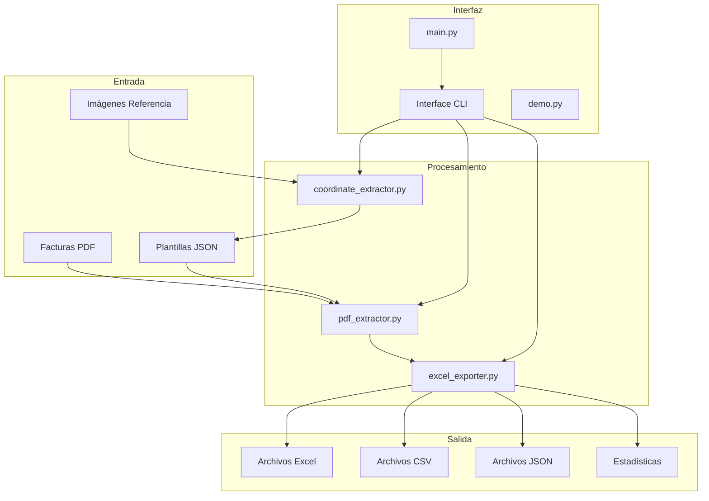

# Guía Técnica - Extractor de Datos de Facturas PDF

## Tabla de Contenidos

1. [Arquitectura del Sistema](#arquitectura-del-sistema)
2. [Módulos y Componentes](#módulos-y-componentes)
3. [Algoritmos de Extracción](#algoritmos-de-extracción)
4. [Sistema de Coordenadas](#sistema-de-coordenadas)
5. [Formatos de Datos](#formatos-de-datos)
6. [API y Extensibilidad](#api-y-extensibilidad)
7. [Configuración Avanzada](#configuración-avanzada)
8. [Debugging y Logging](#debugging-y-logging)
9. [Performance y Optimización](#performance-y-optimización)
10. [Desarrollo y Contribuciones](#desarrollo-y-contribuciones)

---

## Arquitectura del Sistema

### Diseño General



### Patrones de Diseño Implementados

#### 1. Strategy Pattern
```python
class DataProcessor:
    def __init__(self, extraction_strategy):
        self.strategy = extraction_strategy

    def process(self, data):
        return self.strategy.extract(data)

# Estrategias específicas
class TextStrategy:
    def extract(self, text): ...

class DateStrategy:
    def extract(self, text): ...

class NumericStrategy:
    def extract(self, text): ...
```

#### 2. Factory Pattern
```python
class ExtractorFactory:
    @staticmethod
    def create_extractor(file_type):
        if file_type == 'pdf':
            return PDFExtractor()
        elif file_type == 'image':
            return ImageExtractor()
        else:
            raise ValueError(f"Tipo no soportado: {file_type}")
```

#### 3. Template Method Pattern
```python
class BaseExporter:
    def export(self, data):
        self.validate_data(data)
        processed_data = self.process_data(data)
        self.write_output(processed_data)

    def validate_data(self, data):
        # Validación común
        pass

    def process_data(self, data):
        # Método abstracto - implementar en subclases
        raise NotImplementedError

    def write_output(self, data):
        # Método abstracto - implementar en subclases
        raise NotImplementedError
```

---

## Módulos y Componentes

### coordinate_extractor.py

#### Clase CoordinateExtractor

```python
class CoordinateExtractor:
    """
    Extractor interactivo de coordenadas usando OpenCV.
    Permite selección visual de campos en imágenes de facturas.
    """

    def __init__(self, imagen_path: str, dpi: int = 300):
        self.imagen_path = imagen_path
        self.dpi = dpi
        self.coordenadas_seleccionadas = []
        self.campos_extraidos = []
```

#### Métodos Principales

**`convertir_pdf_a_imagen()`**
```python
def convertir_pdf_a_imagen(self, pdf_path: str, output_path: str = None, pagina: int = 0) -> str:
    """
    Convierte PDF a imagen usando pdf2image.

    Args:
        pdf_path: Ruta al archivo PDF
        output_path: Ruta de salida (opcional)
        pagina: Número de página (0-indexed)

    Returns:
        str: Ruta de la imagen generada

    Raises:
        Exception: Si la conversión falla
    """
```

**`convertir_pixeles_a_pdf()`**
```python
def convertir_pixeles_a_pdf(self, x_min: int, y_min: int, x_max: int, y_max: int) -> List[float]:
    """
    Convierte coordenadas píxeles a coordenadas PDF.

    Fórmula de conversión:
    - factor_escala = 72.0 / dpi
    - x_pdf = x_pixel * factor_escala
    - y_pdf = (altura_imagen - y_pixel) * factor_escala  # Invertir eje Y

    Args:
        x_min, y_min, x_max, y_max: Coordenadas en píxeles

    Returns:
        List[float]: [x1, y1, x2, y2] en coordenadas PDF
    """
```

### pdf_extractor.py

#### Clase PDFExtractor

```python
class PDFExtractor:
    """
    Motor principal de extracción de datos PDF.
    Usa plantillas JSON para extraer campos específicos.
    """

    def __init__(self, directorio_facturas: str = "facturas",
                 directorio_plantillas: str = "plantillas"):
        self.directorio_facturas = directorio_facturas
        self.directorio_plantillas = directorio_plantillas
        self.plantillas_cargadas = {}
        self.resultados = []
```

#### Algoritmos de Identificación

**Identificación por Nombre de Archivo:**
```python
def identificar_por_archivo(self, nombre_archivo: str) -> Optional[str]:
    """
    Estrategia 1: Busca coincidencias entre el nombre del archivo
    y palabras clave en los nombres de proveedores.

    Algoritmo:
    1. Extraer palabras del nombre del archivo
    2. Para cada proveedor en plantillas:
       a. Extraer palabras del nombre del proveedor
       b. Buscar coincidencias (palabras > 3 caracteres)
       c. Si hay coincidencia, retornar ID del proveedor

    Complejidad: O(n*m) donde n=proveedores, m=palabras promedio
    """
```

**Identificación por Contenido:**
```python
def identificar_por_contenido(self, ruta_pdf: str) -> Optional[str]:
    """
    Estrategia 2: Extrae texto de la primera página del PDF
    y busca coincidencias con nombres de proveedores.

    Algoritmo:
    1. Extraer texto completo de primera página
    2. Normalizar texto (lowercase, quitar acentos)
    3. Para cada proveedor:
       a. Calcular score de coincidencia de palabras
       b. Si score >= 50%, considerar match
    4. Retornar proveedor con mayor score

    Complejidad: O(n*t) donde n=proveedores, t=tokens en texto
    """
```

#### Procesamiento de Campos

**Limpieza de Texto:**
```python
def limpiar_texto(self, texto: str) -> str:
    """
    Algoritmo de limpieza:
    1. Remover caracteres de control (\x00-\x1f, \x7f-\x9f)
    2. Normalizar espacios múltiples a uno solo
    3. Trim espacios iniciales y finales

    Regex utilizadas:
    - Control chars: r'[\x00-\x1f\x7f-\x9f]'
    - Espacios múltiples: r'\s+'
    """
```

**Limpieza de Números:**
```python
def limpiar_numerico(self, texto: str) -> str:
    """
    Algoritmo para normalizar números:

    1. Detectar formato (europeo vs americano):
       - Si tiene ',' y '.': determinar por posición relativa
       - Solo ',': determinar por contexto (decimal vs miles)

    2. Convertir a formato estándar (punto decimal):
       - Europeo 1.234,56 → 1234.56
       - Americano 1,234.56 → 1234.56

    3. Validar resultado con float()

    Casos especiales:
    - 1,234 → 1234 (separador de miles)
    - 123,45 → 123.45 (decimal europeo)
    - €1.234,56 → 1234.56 (con símbolo)
    """
```

### excel_exporter.py

#### Clase ExcelExporter

```python
class ExcelExporter:
    """
    Exportador multi-formato con capacidades avanzadas de formateo.
    Soporta Excel (básico y formateado), CSV y JSON.
    """

    def __init__(self, datos: List[Dict[str, Any]], directorio_salida: str = "resultados"):
        self.datos = datos
        self.directorio_salida = directorio_salida
        self.timestamp = datetime.now().strftime("%Y%m%d_%H%M%S")
```

#### Generación de Excel Formateado

**Estructura de Hojas:**
```python
def _crear_estructura_excel(self, wb: Workbook, df: pd.DataFrame):
    """
    Estructura del Excel formateado:

    1. Hoja "Resumen":
       - Metadatos de procesamiento
       - Estadísticas generales
       - Breakdown por proveedor

    2. Hoja "Facturas_Exitosas":
       - Datos principales
       - Formato tabla con bordes
       - Resaltado condicional

    3. Hoja "Facturas_Con_Errores":
       - Registros con problemas
       - Errores destacados en rojo
       - Información de diagnóstico

    4. Hoja "Estadísticas":
       - Métricas por campo
       - Tasa de éxito
       - Campos problemáticos
    """
```

**Formateo Condicional:**
```python
def _aplicar_formato_condicional(self, ws: Worksheet):
    """
    Reglas de formato:
    1. Errores → Fondo rojo (#FFCCCC)
    2. Encabezados → Fondo azul (#366092), texto blanco
    3. Bordes → Líneas finas en todas las celdas
    4. Alineación → Centro para encabezados, izquierda para datos
    """
```

---

## Algoritmos de Extracción

### Algoritmo Principal de Extracción

```python
def extraer_datos_factura(self, ruta_pdf: str, proveedor_id: str) -> Dict[str, Any]:
    """
    Algoritmo principal de extracción:

    1. INICIALIZACIÓN:
       - Cargar plantilla del proveedor
       - Inicializar diccionario de resultados
       - Abrir archivo PDF

    2. PROCESAMIENTO POR CAMPO:
       Para cada campo en plantilla:
         a. Obtener coordenadas (bbox)
         b. Extraer área específica del PDF
         c. Aplicar algoritmo de limpieza según tipo
         d. Almacenar resultado

    3. MANEJO DE ERRORES:
       - Capturar errores por campo individual
       - Marcar campos problemáticos como "ERROR"
       - Continuar con siguiente campo

    4. POSTPROCESAMIENTO:
       - Agregar metadatos (archivo, proveedor, timestamp)
       - Validar consistencia de datos
       - Retornar estructura completa

    Complejidad: O(n) donde n = número de campos en plantilla
    """
```

### Algoritmo de Matching de Patrones

#### Fechas
```python
def extraer_fecha(self, texto: str) -> str:
    """
    Algoritmo de extracción de fechas:

    Patrones soportados (en orden de prioridad):
    1. DD/MM/YYYY o DD-MM-YYYY
    2. YYYY/MM/DD o YYYY-MM-DD
    3. DD de MMMM de YYYY (español)
    4. Month DD, YYYY (inglés)

    Algoritmo:
    1. Normalizar texto (quitar espacios extra)
    2. Aplicar regex en orden de prioridad
    3. Validar fecha extraída
    4. Retornar primera coincidencia válida

    Regex patterns:
    - r'\d{1,2}[/-]\d{1,2}[/-]\d{4}'
    - r'\d{4}[/-]\d{1,2}[/-]\d{1,2}'
    - r'\d{1,2}\s+de\s+\w+\s+de\s+\d{4}'
    """
```

#### Números
```python
def extraer_numero(self, texto: str) -> float:
    """
    Algoritmo de extracción numérica:

    1. LIMPIEZA INICIAL:
       - Remover caracteres no numéricos excepto [.,+-]
       - Preservar signos y separadores decimales/miles

    2. DETECCIÓN DE FORMATO:
       if contiene_ambos(',', '.'):
           if posicion_coma > posicion_punto:
               formato = EUROPEO  # 1.234,56
           else:
               formato = AMERICANO  # 1,234.56
       elif solo_coma:
           if partes_coma == 2 AND len(parte_decimal) <= 2:
               formato = DECIMAL_EUROPEO  # 123,45
           else:
               formato = MILES  # 1,234

    3. NORMALIZACIÓN:
       - Convertir todo a formato punto decimal
       - Validar con float()
       - Retornar número o texto original si falla

    Casos edge:
    - €1.234,56 → 1234.56
    - (1,234.56) → -1234.56 (paréntesis = negativo)
    - 1.234.567,89 → 1234567.89
    """
```

---

## Sistema de Coordenadas

### Sistemas de Referencia

#### PDF Coordinate System
```
PDF (Origin: bottom-left)
┌─────────────────────────┐ ← (0, height)
│                         │
│  ┌─────────────┐       │
│  │   FIELD     │       │ Y+ (upward)
│  │ (x1,y2) ──→ │       │
│  │     │       │       │
│  │     ↓       │       │
│  │  (x2,y1)    │       │
│  └─────────────┘       │
│                         │
│ X+ (rightward)          │
└─────────────────────────┘ ← (0, 0)
```

#### Image Coordinate System
```
IMAGE (Origin: top-left)
┌─────────────────────────┐ ← (0, 0)
│                         │
│  ┌─────────────┐       │
│  │   FIELD     │       │ Y+ (downward)
│  │ (x1,y1) ──→ │       │
│  │     │       │       │
│  │     ↓       │       │
│  │  (x2,y2)    │       │
│  └─────────────┘       │
│                         │
│ X+ (rightward)          │
└─────────────────────────┘ ← (0, height)
```

### Algoritmo de Conversión

```python
def convert_image_to_pdf_coordinates(x_img, y_img, image_height, dpi):
    """
    Conversión de coordenadas imagen a PDF:

    1. Factor de escala: scale = 72.0 / dpi
       (72 puntos por pulgada es estándar PDF)

    2. Conversión X (misma dirección):
       x_pdf = x_img * scale

    3. Conversión Y (invertir eje):
       y_pdf = (image_height - y_img) * scale

    Ejemplo con DPI=300:
    - scale = 72/300 = 0.24
    - x_img=1000, y_img=500, height=2000
    - x_pdf = 1000 * 0.24 = 240.0
    - y_pdf = (2000 - 500) * 0.24 = 360.0
    """
```

### Precisión y Tolerancias

```python
class CoordinatePrecision:
    """
    Configuración de precisión para coordenadas:
    """

    # Tolerancia para matching de coordenadas (puntos PDF)
    COORDINATE_TOLERANCE = 2.0

    # DPI recomendado para máxima precisión
    RECOMMENDED_DPI = 300

    # Margen mínimo alrededor del texto
    MIN_MARGIN = 5.0

    # Área máxima para un campo (evitar selecciones accidentales)
    MAX_FIELD_AREA = 10000.0  # puntos cuadrados
```

---

## Formatos de Datos

### Estructura de Plantillas JSON

#### Schema Completo
```json
{
    "$schema": "https://json-schema.org/draft/2020-12/schema",
    "type": "object",
    "title": "Plantilla de Extracción de Facturas",
    "properties": {
        "proveedor_id": {
            "type": "string",
            "pattern": "^[A-Z0-9_]+$",
            "description": "ID único del proveedor"
        },
        "nombre_proveedor": {
            "type": "string",
            "minLength": 1,
            "description": "Nombre completo del proveedor"
        },
        "imagen_referencia": {
            "type": "string",
            "description": "Ruta a imagen de referencia"
        },
        "dpi_imagen": {
            "type": "integer",
            "minimum": 72,
            "maximum": 600,
            "default": 300
        },
        "campos": {
            "type": "array",
            "items": {
                "$ref": "#/$defs/campo"
            }
        }
    },
    "$defs": {
        "campo": {
            "type": "object",
            "properties": {
                "nombre": {
                    "type": "string",
                    "pattern": "^[a-zA-Z_][a-zA-Z0-9_]*$"
                },
                "coordenadas": {
                    "type": "array",
                    "items": {"type": "number"},
                    "minItems": 4,
                    "maxItems": 4
                },
                "tipo": {
                    "type": "string",
                    "enum": ["texto", "fecha", "numerico"]
                },
                "obligatorio": {
                    "type": "boolean",
                    "default": true
                },
                "validacion": {
                    "type": "object",
                    "properties": {
                        "regex": {"type": "string"},
                        "min_length": {"type": "integer"},
                        "max_length": {"type": "integer"}
                    }
                }
            },
            "required": ["nombre", "coordenadas", "tipo"]
        }
    }
}
```

### Estructura de Datos Extraídos

#### Formato de Salida Estándar
```python
class ExtractedData:
    """
    Estructura estándar para datos extraídos.
    """

    # Metadatos obligatorios
    archivo: str                    # Nombre del archivo PDF
    proveedor_id: str              # ID del proveedor identificado
    proveedor_nombre: str          # Nombre del proveedor
    fecha_procesamiento: str       # Timestamp ISO 8601

    # Campos extraídos (dinámicos según plantilla)
    campos_extraidos: Dict[str, Any]

    # Información de errores (opcional)
    errores: List[str]             # Lista de errores encontrados
    campos_fallidos: List[str]     # Campos que no se pudieron extraer

    # Métricas de calidad
    tasa_exito: float             # % de campos extraídos exitosamente
    tiempo_procesamiento: float    # Segundos de procesamiento
```

### Validaciones de Datos

```python
class DataValidator:
    """
    Validador de datos extraídos con reglas configurables.
    """

    def validar_fecha(self, fecha_str: str) -> ValidationResult:
        """
        Validaciones para fechas:
        1. Formato válido según patrones conocidos
        2. Fecha lógica (no futuro lejano, no pasado muy lejano)
        3. Coherencia con contexto (ej: fecha vencimiento > fecha factura)
        """

    def validar_numero(self, numero_str: str) -> ValidationResult:
        """
        Validaciones para números:
        1. Formato numérico válido
        2. Rangos lógicos (ej: importes no negativos)
        3. Coherencia matemática (ej: total = base + IVA)
        """

    def validar_texto(self, texto: str, campo: str) -> ValidationResult:
        """
        Validaciones para texto:
        1. Longitud mínima/máxima
        2. Caracteres permitidos
        3. Formatos específicos (ej: NIF, códigos postales)
        """
```

---

## API y Extensibilidad

### Interfaces Programáticas

#### API Principal
```python
class FacturaExtractorAPI:
    """
    API principal para integración programática.
    """

    def __init__(self, config: ExtractorConfig):
        self.config = config
        self.extractor = PDFExtractor()
        self.exporter = ExcelExporter()

    def extraer_factura(self, pdf_path: str, plantilla_id: str) -> ExtractedData:
        """Extrae datos de una factura específica."""

    def procesar_lote(self, pdf_paths: List[str]) -> BatchResult:
        """Procesa múltiples facturas en lote."""

    def registrar_plantilla(self, plantilla: Dict) -> bool:
        """Registra nueva plantilla dinámicamente."""

    def obtener_estadisticas(self) -> ProcessingStats:
        """Obtiene estadísticas de procesamiento."""
```

#### Extensión para Nuevos Formatos

```python
class CustomExtractor(BaseExtractor):
    """
    Clase base para implementar extractores personalizados.
    """

    def extract_data(self, file_path: str, template: Dict) -> Dict:
        """Implementar lógica de extracción específica."""
        raise NotImplementedError

    def validate_format(self, file_path: str) -> bool:
        """Validar si el archivo es compatible."""
        raise NotImplementedError

# Ejemplo: Extractor para imágenes
class ImageExtractor(CustomExtractor):
    def extract_data(self, file_path: str, template: Dict) -> Dict:
        # Usar OCR (tesseract) para extraer texto
        # Aplicar coordenadas de imagen directamente
        pass

# Ejemplo: Extractor para XML
class XMLExtractor(CustomExtractor):
    def extract_data(self, file_path: str, template: Dict) -> Dict:
        # Usar XPath o selectores CSS
        # Mapear elementos XML a campos
        pass
```

### Plugins y Extensiones

#### Sistema de Plugins
```python
class PluginManager:
    """
    Gestor de plugins para funcionalidad extendida.
    """

    def __init__(self):
        self.plugins = {}
        self.hooks = defaultdict(list)

    def register_plugin(self, plugin: BasePlugin):
        """Registra un plugin en el sistema."""

    def execute_hook(self, hook_name: str, *args, **kwargs):
        """Ejecuta todos los plugins registrados para un hook específico."""

    def load_plugins_from_directory(self, plugin_dir: str):
        """Carga plugins desde directorio."""

# Hooks disponibles
HOOKS = {
    'before_extraction': 'Antes de extraer datos',
    'after_extraction': 'Después de extraer datos',
    'before_export': 'Antes de exportar',
    'after_export': 'Después de exportar',
    'on_error': 'Cuando ocurre un error'
}
```

#### Ejemplo de Plugin
```python
class EmailNotificationPlugin(BasePlugin):
    """Plugin que envía notificaciones por email."""

    def __init__(self, smtp_config: Dict):
        self.smtp_config = smtp_config

    @hook('after_export')
    def notify_completion(self, export_result: ExportResult):
        """Envía email cuando se completa la exportación."""
        subject = f"Procesamiento completado: {export_result.files_count} facturas"
        body = self.generate_summary(export_result)
        self.send_email(subject, body)

class DatabaseStoragePlugin(BasePlugin):
    """Plugin que almacena resultados en base de datos."""

    @hook('after_extraction')
    def store_data(self, extracted_data: ExtractedData):
        """Almacena datos extraídos en BD."""
        self.db.insert_factura(extracted_data)
```

---

## Configuración Avanzada

### Archivo de Configuración

```yaml
# config.yaml
extractor:
  # Configuración del motor de extracción
  default_dpi: 300
  coordinate_tolerance: 2.0
  max_processing_time: 300  # segundos

  # Directorios
  directories:
    input: "facturas"
    templates: "plantillas"
    output: "resultados"
    temp: "temp"

  # Identificación de proveedores
  provider_identification:
    strategies: ["filename", "content"]
    content_match_threshold: 0.5
    filename_word_min_length: 3

# Configuración de limpieza de datos
data_cleaning:
  text:
    remove_control_chars: true
    normalize_whitespace: true
    max_length: 1000

  numeric:
    decimal_places: 2
    allow_negative: false
    max_value: 999999.99

  date:
    allowed_formats:
      - "%d/%m/%Y"
      - "%d-%m-%Y"
      - "%Y/%m/%d"
    min_year: 2000
    max_year: 2030

# Configuración de exportación
export:
  excel:
    include_formatting: true
    auto_filter: true
    freeze_header: true

  csv:
    delimiter: ";"
    encoding: "utf-8-sig"

  json:
    include_metadata: true
    pretty_print: true

# Logging
logging:
  level: "INFO"
  file: "extractor.log"
  max_size: "10MB"
  backup_count: 5

  formatters:
    default: "%(asctime)s - %(name)s - %(levelname)s - %(message)s"
```

### Carga de Configuración

```python
class ExtractorConfig:
    """
    Configuración centralizada de la aplicación.
    """

    def __init__(self, config_file: str = "config.yaml"):
        self.config_file = config_file
        self.config = self.load_config()

    def load_config(self) -> Dict:
        """Carga configuración desde archivo YAML."""
        with open(self.config_file, 'r') as f:
            return yaml.safe_load(f)

    def get(self, key_path: str, default=None):
        """
        Obtiene valor de configuración usando dot notation.

        Ejemplo:
        config.get('extractor.default_dpi') → 300
        config.get('export.csv.delimiter') → ';'
        """
        keys = key_path.split('.')
        value = self.config

        for key in keys:
            if isinstance(value, dict) and key in value:
                value = value[key]
            else:
                return default

        return value

    def validate_config(self) -> List[str]:
        """Valida configuración y retorna lista de errores."""
        errors = []

        # Validar directorios requeridos
        required_dirs = ['input', 'templates', 'output']
        for dir_key in required_dirs:
            if not self.get(f'extractor.directories.{dir_key}'):
                errors.append(f"Directorio requerido no configurado: {dir_key}")

        # Validar rangos numéricos
        dpi = self.get('extractor.default_dpi')
        if not (72 <= dpi <= 600):
            errors.append(f"DPI fuera de rango válido (72-600): {dpi}")

        return errors
```

---

## Debugging y Logging

### Sistema de Logging

```python
import logging
from logging.handlers import RotatingFileHandler

class ExtractorLogger:
    """
    Sistema de logging avanzado para el extractor.
    """

    def __init__(self, config: ExtractorConfig):
        self.config = config
        self.setup_logging()

    def setup_logging(self):
        """Configura sistema de logging."""

        # Logger principal
        self.logger = logging.getLogger('extractor')
        self.logger.setLevel(getattr(logging, self.config.get('logging.level', 'INFO')))

        # Handler para archivo con rotación
        file_handler = RotatingFileHandler(
            self.config.get('logging.file', 'extractor.log'),
            maxBytes=10*1024*1024,  # 10MB
            backupCount=5
        )

        # Handler para consola
        console_handler = logging.StreamHandler()

        # Formatter
        formatter = logging.Formatter(
            self.config.get('logging.formatters.default',
                           '%(asctime)s - %(name)s - %(levelname)s - %(message)s')
        )

        file_handler.setFormatter(formatter)
        console_handler.setFormatter(formatter)

        self.logger.addHandler(file_handler)
        self.logger.addHandler(console_handler)

    def log_extraction_start(self, pdf_path: str, provider_id: str):
        """Log inicio de extracción."""
        self.logger.info(f"Iniciando extracción: {pdf_path} -> {provider_id}")

    def log_field_extraction(self, field_name: str, coordinates: List[float],
                           extracted_value: str, processing_time: float):
        """Log extracción de campo individual."""
        self.logger.debug(
            f"Campo: {field_name}, "
            f"Coords: {coordinates}, "
            f"Valor: '{extracted_value}', "
            f"Tiempo: {processing_time:.3f}s"
        )

    def log_error(self, error: Exception, context: Dict):
        """Log errores con contexto."""
        self.logger.error(
            f"Error: {str(error)}, "
            f"Contexto: {json.dumps(context, indent=2)}"
        )
```

### Debugging Tools

```python
class DebugTool:
    """
    Herramientas de debugging para desarrollo y troubleshooting.
    """

    def __init__(self, extractor: PDFExtractor):
        self.extractor = extractor

    def visualize_extraction(self, pdf_path: str, template_id: str,
                           output_image: str = None):
        """
        Genera imagen mostrando áreas de extracción sobre el PDF.
        """
        # Convertir PDF a imagen
        image = self.pdf_to_image(pdf_path)

        # Obtener plantilla
        template = self.extractor.plantillas_cargadas[template_id]

        # Dibujar rectángulos para cada campo
        for field in template['campos']:
            coords = field['coordenadas']
            # Convertir coordenadas PDF a píxeles
            pixel_coords = self.pdf_to_pixel_coords(coords, image.size)

            # Dibujar rectángulo
            draw = ImageDraw.Draw(image)
            draw.rectangle(pixel_coords, outline='red', width=2)
            draw.text((pixel_coords[0], pixel_coords[1]-20),
                     field['nombre'], fill='red')

        # Guardar imagen
        if output_image:
            image.save(output_image)
        else:
            image.show()

    def test_field_extraction(self, pdf_path: str, template_id: str,
                            field_name: str) -> Dict:
        """
        Prueba extracción de un campo específico con información detallada.
        """
        template = self.extractor.plantillas_cargadas[template_id]
        field_config = next(f for f in template['campos'] if f['nombre'] == field_name)

        with pdfplumber.open(pdf_path) as pdf:
            page = pdf.pages[0]

            # Extraer área específica
            bbox = tuple(field_config['coordenadas'])
            cropped_area = page.crop(bbox)

            # Obtener información detallada
            return {
                'field_name': field_name,
                'coordinates': field_config['coordenadas'],
                'extracted_text': cropped_area.extract_text(),
                'area_chars': cropped_area.chars,
                'area_words': cropped_area.extract_words(),
                'bbox_dimensions': {
                    'width': bbox[2] - bbox[0],
                    'height': bbox[3] - bbox[1],
                    'area': (bbox[2] - bbox[0]) * (bbox[3] - bbox[1])
                }
            }

    def analyze_pdf_structure(self, pdf_path: str) -> Dict:
        """
        Analiza estructura del PDF para debugging.
        """
        with pdfplumber.open(pdf_path) as pdf:
            analysis = {
                'page_count': len(pdf.pages),
                'pages': []
            }

            for i, page in enumerate(pdf.pages):
                page_info = {
                    'page_number': i,
                    'dimensions': {
                        'width': page.width,
                        'height': page.height
                    },
                    'text_stats': {
                        'total_chars': len(page.chars),
                        'total_words': len(page.extract_words()),
                        'total_lines': len(page.extract_text().split('\n'))
                    },
                    'objects': {
                        'chars': len(page.chars),
                        'lines': len(page.lines),
                        'rects': len(page.rects),
                        'images': len(page.images)
                    }
                }
                analysis['pages'].append(page_info)

        return analysis
```

### Performance Profiling

```python
class PerformanceProfiler:
    """
    Profiler para medir rendimiento del extractor.
    """

    def __init__(self):
        self.timings = defaultdict(list)
        self.memory_usage = []

    @contextmanager
    def measure_time(self, operation_name: str):
        """Context manager para medir tiempo de operaciones."""
        start_time = time.time()
        start_memory = psutil.Process().memory_info().rss / 1024 / 1024  # MB

        try:
            yield
        finally:
            end_time = time.time()
            end_memory = psutil.Process().memory_info().rss / 1024 / 1024  # MB

            duration = end_time - start_time
            memory_diff = end_memory - start_memory

            self.timings[operation_name].append(duration)
            self.memory_usage.append({
                'operation': operation_name,
                'duration': duration,
                'memory_delta': memory_diff,
                'timestamp': datetime.now()
            })

    def get_stats(self) -> Dict:
        """Obtiene estadísticas de rendimiento."""
        stats = {}

        for operation, times in self.timings.items():
            stats[operation] = {
                'count': len(times),
                'total_time': sum(times),
                'avg_time': sum(times) / len(times),
                'min_time': min(times),
                'max_time': max(times),
                'std_dev': np.std(times)
            }

        return stats

    def generate_report(self, output_file: str = None):
        """Genera reporte de rendimiento."""
        stats = self.get_stats()

        report = "=== PERFORMANCE REPORT ===\n\n"

        for operation, data in stats.items():
            report += f"Operation: {operation}\n"
            report += f"  Count: {data['count']}\n"
            report += f"  Total Time: {data['total_time']:.3f}s\n"
            report += f"  Average Time: {data['avg_time']:.3f}s\n"
            report += f"  Min/Max Time: {data['min_time']:.3f}s / {data['max_time']:.3f}s\n"
            report += f"  Std Deviation: {data['std_dev']:.3f}s\n\n"

        if output_file:
            with open(output_file, 'w') as f:
                f.write(report)
        else:
            print(report)
```

---

## Performance y Optimización

### Métricas de Rendimiento

#### Benchmarks Objetivo
```python
PERFORMANCE_TARGETS = {
    'pdf_loading': 0.5,      # segundos por PDF
    'field_extraction': 0.1,  # segundos por campo
    'data_cleaning': 0.05,    # segundos por campo
    'template_matching': 2.0, # segundos por PDF
    'export_generation': 5.0, # segundos por lote
    'memory_usage': 500,      # MB máximo
}
```

### Estrategias de Optimización

#### 1. Caching de Plantillas
```python
class TemplateCache:
    """
    Cache LRU para plantillas cargadas.
    """

    def __init__(self, max_size: int = 100):
        self.cache = {}
        self.max_size = max_size
        self.access_order = []

    def get_template(self, template_id: str) -> Dict:
        """Obtiene plantilla del cache o la carga."""
        if template_id in self.cache:
            # Actualizar orden de acceso
            self.access_order.remove(template_id)
            self.access_order.append(template_id)
            return self.cache[template_id]

        # Cargar plantilla
        template = self.load_template_from_disk(template_id)
        self.cache[template_id] = template
        self.access_order.append(template_id)

        # Limpiar cache si excede tamaño máximo
        if len(self.cache) > self.max_size:
            oldest = self.access_order.pop(0)
            del self.cache[oldest]

        return template
```

#### 2. Procesamiento Paralelo
```python
from concurrent.futures import ThreadPoolExecutor, ProcessPoolExecutor
import multiprocessing

class ParallelExtractor:
    """
    Extractor con capacidades de procesamiento paralelo.
    """

    def __init__(self, max_workers: int = None):
        self.max_workers = max_workers or multiprocessing.cpu_count()

    def process_pdfs_parallel(self, pdf_paths: List[str]) -> List[Dict]:
        """Procesa PDFs en paralelo usando threads."""
        with ThreadPoolExecutor(max_workers=self.max_workers) as executor:
            futures = [
                executor.submit(self.process_single_pdf, pdf_path)
                for pdf_path in pdf_paths
            ]

            results = []
            for future in futures:
                try:
                    result = future.result()
                    results.append(result)
                except Exception as e:
                    # Log error y continuar
                    logging.error(f"Error procesando PDF: {e}")
                    results.append({'error': str(e)})

            return results

    def process_fields_parallel(self, page, fields: List[Dict]) -> Dict:
        """Procesa campos de una página en paralelo."""
        with ThreadPoolExecutor(max_workers=min(len(fields), 4)) as executor:
            futures = {
                executor.submit(self.extract_field, page, field): field['nombre']
                for field in fields
            }

            results = {}
            for future, field_name in futures.items():
                try:
                    results[field_name] = future.result()
                except Exception as e:
                    results[field_name] = f"ERROR: {str(e)}"

            return results
```

#### 3. Optimización de Memoria
```python
class MemoryOptimizedExtractor:
    """
    Extractor optimizado para uso eficiente de memoria.
    """

    def __init__(self):
        self.pdf_cache_size = 1  # Solo mantener 1 PDF en memoria
        self.current_pdf = None
        self.current_pdf_path = None

    def extract_with_memory_management(self, pdf_path: str, template: Dict) -> Dict:
        """Extrae datos con gestión optimizada de memoria."""

        # Cargar PDF solo si es diferente al actual
        if self.current_pdf_path != pdf_path:
            if self.current_pdf:
                self.current_pdf.close()

            self.current_pdf = pdfplumber.open(pdf_path)
            self.current_pdf_path = pdf_path

        # Procesar página por página para reducir memoria
        results = {}
        page = self.current_pdf.pages[0]

        for field in template['campos']:
            # Extraer campo y limpiar inmediatamente
            value = self.extract_field_optimized(page, field)
            results[field['nombre']] = value

            # Forzar garbage collection si es necesario
            if len(results) % 10 == 0:
                gc.collect()

        return results

    def extract_field_optimized(self, page, field: Dict) -> str:
        """Extrae campo con uso mínimo de memoria."""
        bbox = tuple(field['coordenadas'])

        # Crear área recortada temporal
        cropped = page.crop(bbox)
        text = cropped.extract_text()

        # Limpiar referencia inmediatamente
        del cropped

        return self.clean_field_value(text, field['tipo'])
```

#### 4. Indexación y Búsqueda Rápida
```python
class FastProviderMatcher:
    """
    Matcher optimizado para identificación rápida de proveedores.
    """

    def __init__(self, templates: Dict[str, Dict]):
        self.templates = templates
        self.filename_index = self.build_filename_index()
        self.content_index = self.build_content_index()

    def build_filename_index(self) -> Dict[str, List[str]]:
        """Construye índice para matching por nombre de archivo."""
        index = defaultdict(list)

        for template_id, template in self.templates.items():
            provider_name = template['nombre_proveedor'].lower()
            words = re.findall(r'\b\w{3,}\b', provider_name)

            for word in words:
                index[word].append(template_id)

        return dict(index)

    def match_by_filename_fast(self, filename: str) -> Optional[str]:
        """Matching rápido usando índice pre-construido."""
        filename_lower = filename.lower()
        candidate_scores = defaultdict(int)

        # Buscar palabras en índice
        for word in re.findall(r'\b\w{3,}\b', filename_lower):
            if word in self.filename_index:
                for template_id in self.filename_index[word]:
                    candidate_scores[template_id] += 1

        # Retornar candidato con mayor score
        if candidate_scores:
            best_match = max(candidate_scores.items(), key=lambda x: x[1])
            return best_match[0] if best_match[1] > 0 else None

        return None
```

---

## Desarrollo y Contribuciones

### Estructura de Testing

```python
# tests/test_extractor.py
import unittest
import tempfile
import os
from unittest.mock import Mock, patch

class TestPDFExtractor(unittest.TestCase):
    """
    Test suite para PDFExtractor.
    """

    def setUp(self):
        """Configuración inicial para cada test."""
        self.temp_dir = tempfile.mkdtemp()
        self.extractor = PDFExtractor(
            directorio_facturas=os.path.join(self.temp_dir, 'facturas'),
            directorio_plantillas=os.path.join(self.temp_dir, 'plantillas')
        )

        # Crear estructura de directorios
        os.makedirs(self.extractor.directorio_facturas)
        os.makedirs(self.extractor.directorio_plantillas)

    def tearDown(self):
        """Limpieza después de cada test."""
        shutil.rmtree(self.temp_dir)

    def test_cargar_plantillas_validas(self):
        """Test carga de plantillas válidas."""
        # Crear plantilla de prueba
        plantilla_test = {
            "proveedor_id": "TEST_001",
            "nombre_proveedor": "Proveedor Test",
            "campos": [
                {
                    "nombre": "campo_test",
                    "coordenadas": [0, 0, 100, 100],
                    "tipo": "texto"
                }
            ]
        }

        plantilla_path = os.path.join(self.extractor.directorio_plantillas, 'test.json')
        with open(plantilla_path, 'w') as f:
            json.dump(plantilla_test, f)

        # Ejecutar test
        result = self.extractor.cargar_plantillas()

        # Verificar resultados
        self.assertTrue(result)
        self.assertIn('TEST_001', self.extractor.plantillas_cargadas)
        self.assertEqual(
            self.extractor.plantillas_cargadas['TEST_001']['nombre_proveedor'],
            'Proveedor Test'
        )

    @patch('pdfplumber.open')
    def test_identificar_proveedor_por_contenido(self, mock_open):
        """Test identificación de proveedor por contenido del PDF."""
        # Mock del PDF
        mock_pdf = Mock()
        mock_page = Mock()
        mock_page.extract_text.return_value = "Factura de Proveedor Test S.L."
        mock_pdf.pages = [mock_page]
        mock_open.return_value.__enter__.return_value = mock_pdf

        # Cargar plantilla de prueba
        self.extractor.plantillas_cargadas = {
            'TEST_001': {
                'nombre_proveedor': 'Proveedor Test'
            }
        }

        # Ejecutar test
        result = self.extractor.identificar_proveedor('fake_path.pdf')

        # Verificar resultado
        self.assertEqual(result, 'TEST_001')

    def test_limpiar_numerico_formato_europeo(self):
        """Test limpieza de números en formato europeo."""
        test_cases = [
            ('1.234,56', '1234.56'),
            ('€1.234,56', '1234.56'),
            ('1,234.56', '1234.56'),
            ('123,45', '123.45'),
            ('1.234', '1234'),
        ]

        for input_val, expected in test_cases:
            with self.subTest(input_val=input_val):
                result = self.extractor.limpiar_numerico(input_val)
                self.assertEqual(result, expected)

class TestCoordinateExtractor(unittest.TestCase):
    """
    Test suite para CoordinateExtractor.
    """

    def test_convertir_pixeles_a_pdf(self):
        """Test conversión de coordenadas píxeles a PDF."""
        extractor = CoordinateExtractor('', dpi=300)
        extractor.img = Mock()
        extractor.img.shape = [2000, 1500, 3]  # height, width, channels

        # Test básico
        result = extractor.convertir_pixeles_a_pdf(100, 200, 300, 400)

        # Verificar formato de salida
        self.assertEqual(len(result), 4)
        self.assertIsInstance(result[0], float)

        # Verificar que las coordenadas Y están invertidas
        self.assertLess(result[1], result[3])  # y1 < y2 en coordenadas PDF

# tests/test_integration.py
class TestIntegration(unittest.TestCase):
    """
    Tests de integración end-to-end.
    """

    def test_flujo_completo(self):
        """Test del flujo completo desde PDF hasta Excel."""
        # Crear entorno de prueba
        with tempfile.TemporaryDirectory() as temp_dir:
            # Configurar directorios
            facturas_dir = os.path.join(temp_dir, 'facturas')
            plantillas_dir = os.path.join(temp_dir, 'plantillas')
            resultados_dir = os.path.join(temp_dir, 'resultados')

            os.makedirs(facturas_dir)
            os.makedirs(plantillas_dir)
            os.makedirs(resultados_dir)

            # Crear PDF de prueba (mock)
            pdf_test = os.path.join(facturas_dir, 'test_proveedor_a.pdf')
            self.create_mock_pdf(pdf_test)

            # Crear plantilla de prueba
            plantilla = {
                "proveedor_id": "PROV_TEST",
                "nombre_proveedor": "Proveedor A",
                "campos": [
                    {
                        "nombre": "total",
                        "coordenadas": [100, 100, 200, 120],
                        "tipo": "numerico"
                    }
                ]
            }

            plantilla_path = os.path.join(plantillas_dir, 'test.json')
            with open(plantilla_path, 'w') as f:
                json.dump(plantilla, f)

            # Ejecutar extracción
            extractor = PDFExtractor(facturas_dir, plantillas_dir)
            extractor.cargar_plantillas()
            resultados = extractor.procesar_directorio_facturas()

            # Verificar resultados
            self.assertGreater(len(resultados), 0)
            self.assertIn('Archivo', resultados[0])
            self.assertIn('Proveedor_ID', resultados[0])

            # Exportar a Excel
            exporter = ExcelExporter(resultados, resultados_dir)
            excel_path = exporter.exportar_excel_basico()

            # Verificar archivo generado
            self.assertTrue(os.path.exists(excel_path))
            self.assertGreater(os.path.getsize(excel_path), 0)
```

### Guidelines de Contribución

#### Estilo de Código
```python
# coding_standards.py

# 1. Docstrings en formato Google
def extract_field(self, page, field_config: Dict[str, Any]) -> str:
    """
    Extrae texto de un campo específico en una página PDF.

    Args:
        page: Objeto página de pdfplumber
        field_config: Configuración del campo con coordenadas y tipo

    Returns:
        str: Texto extraído y limpiado

    Raises:
        ExtractionError: Si no se puede extraer el campo

    Example:
        >>> field = {"coordenadas": [0, 0, 100, 50], "tipo": "texto"}
        >>> text = extractor.extract_field(page, field)
        >>> print(text)
        "Texto extraído"
    """
    pass

# 2. Type hints obligatorios
from typing import Dict, List, Optional, Union, Any

def process_data(data: List[Dict[str, Any]]) -> Optional[ProcessingResult]:
    pass

# 3. Constantes en UPPER_CASE
DEFAULT_DPI = 300
MAX_FIELD_SIZE = 1000
SUPPORTED_FORMATS = ['pdf', 'png', 'jpg']

# 4. Nombres descriptivos
def calculate_coordinate_scaling_factor(source_dpi: int, target_dpi: int) -> float:
    pass

# 5. Manejo de errores específico
class ExtractionError(Exception):
    """Error durante extracción de datos."""
    pass

class TemplateValidationError(Exception):
    """Error en validación de plantilla."""
    pass
```

#### Proceso de Desarrollo

1. **Fork del repositorio**
2. **Crear branch de feature**: `git checkout -b feature/nueva-funcionalidad`
3. **Implementar con tests**
4. **Ejecutar test suite completo**: `python -m pytest tests/`
5. **Verificar cobertura**: `coverage run -m pytest && coverage report`
6. **Linting**: `flake8 . --max-line-length=100`
7. **Type checking**: `mypy *.py`
8. **Commit con mensaje descriptivo**
9. **Push y crear Pull Request**

#### Checklist para PRs

- [ ] Código sigue estándares de estilo
- [ ] Tests escritos para nueva funcionalidad
- [ ] Tests existentes pasan
- [ ] Documentación actualizada
- [ ] Type hints agregados
- [ ] Performance considerado
- [ ] Backward compatibility mantenida
- [ ] Changelog actualizado

---

*Guía Técnica - Versión 1.0*
*Última actualización: Octubre 2024*