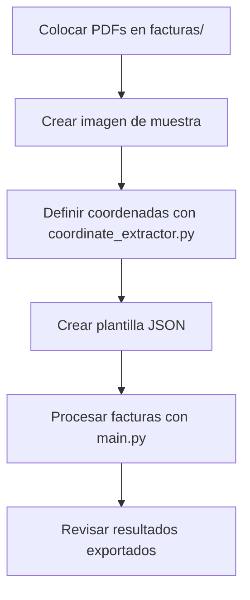
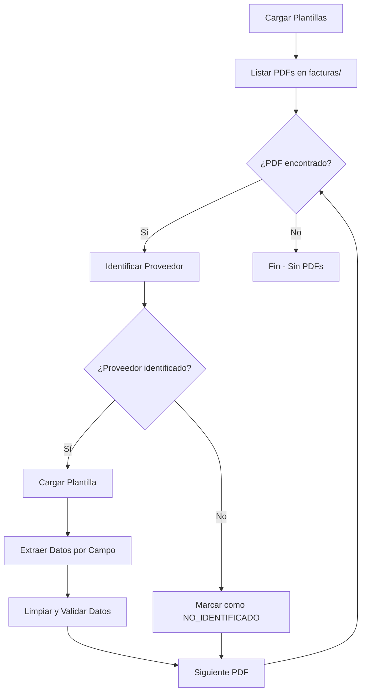

# Manual de Usuario - Extractor de Datos de Facturas PDF

## Tabla de Contenidos

1. [Introducción](#introducción)
2. [Instalación y Configuración](#instalación-y-configuración)
3. [Estructura del Proyecto](#estructura-del-proyecto)
4. [Flujo de Trabajo Completo](#flujo-de-trabajo-completo)
5. [Creación de Plantillas](#creación-de-plantillas)
6. [Procesamiento de Facturas](#procesamiento-de-facturas)
7. [Exportación de Datos](#exportación-de-datos)
8. [Solución de Problemas](#solución-de-problemas)
9. [Casos de Uso Avanzados](#casos-de-uso-avanzados)
10. [Preguntas Frecuentes](#preguntas-frecuentes)

---

## Introducción

Esta aplicación permite extraer datos específicos de facturas PDF de manera automatizada y exportarlos a archivos Excel, CSV o JSON. La aplicación utiliza un sistema de plantillas configurables que permite definir las coordenadas exactas donde se encuentran los datos en cada tipo de factura.

### Características Principales

- **Extracción automática de datos** de facturas PDF
- **Plantillas configurables** por proveedor
- **Identificación automática** de proveedores
- **Múltiples formatos de exportación** (Excel, CSV, JSON)
- **Interfaz visual** para definir coordenadas
- **Estadísticas y reportes** detallados
- **Manejo robusto de errores**

### Requisitos del Sistema

- Python 3.7 o superior
- Windows, macOS o Linux
- Al menos 2GB de RAM
- 500MB de espacio libre en disco

---

## Instalación y Configuración

### Paso 1: Descargar e Instalar Dependencias

```bash
# Navegar al directorio del proyecto
cd extract-pdf-data

# Instalar dependencias
pip install -r requirements.txt
```

### Paso 2: Verificar la Instalación

```bash
# Verificar que todo esté correctamente instalado
python main.py verificar
```

Si la instalación es correcta, verás:
```
OK Estructura del proyecto verificada correctamente
OK Verificación completada.
```

### Paso 3: Ejecutar Demo (Opcional)

```bash
# Ejecutar demostración con datos de ejemplo
python demo.py
```

Esto creará archivos de ejemplo y demostrará el funcionamiento básico.

---

## Estructura del Proyecto

```
extract-pdf-data/
│
├── facturas/              # 📁 Coloca aquí tus archivos PDF
│   ├── factura_001.pdf
│   └── factura_002.pdf
│
├── plantillas/            # 📁 Plantillas JSON por proveedor
│   ├── proveedor_a.json
│   └── proveedor_b.json
│
├── imagenes_muestra/      # 📁 Imágenes de referencia
│   ├── factura_300dpi.png
│   └── muestra_proveedor.jpg
│
├── resultados/            # 📁 Archivos de salida generados
│   ├── facturas_20241022_143052.xlsx
│   ├── facturas_20241022_143052.csv
│   └── facturas_20241022_143052.json
│
├── coordinate_extractor.py    # 🛠️ Herramienta de coordenadas
├── pdf_extractor.py          # 🔧 Motor de extracción
├── excel_exporter.py         # 📊 Exportador de datos
├── main.py                   # 🎮 Script principal
├── demo.py                   # 🧪 Demostración
├── requirements.txt          # 📋 Dependencias
└── README.md                 # 📖 Documentación básica
```

---

## Flujo de Trabajo Completo

### 1. Preparación Inicial



### 2. Proceso Detallado

#### Fase 1: Preparación de Datos
1. **Colocar archivos PDF** en la carpeta `facturas/`
2. **Seleccionar una factura representativa** de cada proveedor
3. **Convertir a imagen** (si es necesario) para facilitar la selección visual

#### Fase 2: Creación de Plantillas
1. **Ejecutar coordinate_extractor.py** para cada tipo de factura
2. **Seleccionar campos visualmente** con el ratón
3. **Definir nombres y tipos** de cada campo
4. **Guardar plantillas JSON** en `plantillas/`

#### Fase 3: Procesamiento
1. **Ejecutar main.py procesar** para extraer todos los datos
2. **Revisar estadísticas** de procesamiento
3. **Validar resultados** en archivos exportados

---

## Creación de Plantillas

### ¿Qué es una Plantilla?

Una plantilla es un archivo JSON que define:
- **Información del proveedor** (ID, nombre)
- **Lista de campos** a extraer
- **Coordenadas exactas** de cada campo en el PDF
- **Tipo de dato** (texto, fecha, numérico)

### Ejemplo de Plantilla

```json
{
    "proveedor_id": "PROV_001",
    "nombre_proveedor": "Suministros ABC, S.L.",
    "imagen_referencia": "imagenes_muestra/factura_abc_300dpi.png",
    "dpi_imagen": 300,
    "campos": [
        {
            "nombre": "NIF_Proveedor",
            "coordenadas": [68.0, 750.0, 150.0, 765.0],
            "tipo": "texto"
        },
        {
            "nombre": "Fecha_Factura",
            "coordenadas": [400.0, 680.0, 500.0, 695.0],
            "tipo": "fecha"
        },
        {
            "nombre": "Total_Factura",
            "coordenadas": [450.0, 100.0, 550.0, 120.0],
            "tipo": "numerico"
        }
    ]
}
```

### Proceso Paso a Paso para Crear Plantillas

#### Método 1: Usando coordinate_extractor.py

1. **Ejecutar el extractor:**
   ```bash
   python coordinate_extractor.py
   ```

2. **Seleccionar opción:**
   - **Opción 1**: Si ya tienes una imagen de la factura
   - **Opción 2**: Si tienes el PDF y necesitas convertirlo

3. **Configurar conversión** (si elegiste opción 2):
   ```
   Ruta del PDF: facturas/factura_ejemplo.pdf
   Número de página (0 para primera): 0
   DPI para conversión (300 recomendado): 300
   ```

4. **Seleccionar campos visualmente:**
   - Aparecerá la imagen de la factura
   - **Clic y arrastra** para seleccionar cada campo
   - La aplicación mostrará un rectángulo verde sobre la selección

5. **Definir cada campo:**
   ```
   Nombre del campo: NIF_Proveedor
   Tipo (texto/fecha/numerico): texto
   ```

6. **Continuar con más campos:**
   - Repite el proceso para todos los campos necesarios
   - Usa 'r' para reiniciar la imagen si cometes errores
   - Usa 's' para guardar progreso intermedio

7. **Guardar plantilla final:**
   ```
   ID del proveedor (ej. PROV_001): PROV_ABC
   Nombre del proveedor: Suministros ABC, S.L.
   Nombre final de la plantilla: proveedor_abc
   ```

#### Método 2: Creación Manual

Si prefieres crear la plantilla manualmente:

1. **Crear archivo JSON** en `plantillas/`
2. **Usar coordenadas aproximadas** basadas en observación
3. **Ajustar iterativamente** probando la extracción

### Coordenadas: Sistema de Referencia

#### Entendiendo las Coordenadas

Las coordenadas en PDF usan el sistema de puntos (72 puntos = 1 pulgada):

```
PDF (Origen en esquina inferior izquierda)
┌─────────────────────────────────┐
│                            │ Y+ │
│  ┌─────────────┐           │    │
│  │   CAMPO     │           │    │
│  │ (x1,y1) ──→ │           │    │
│  │     │       │           │    │
│  │     ↓       │           │    │
│  │  (x2,y2)    │           │    │
│  └─────────────┘           │    │
│                            │    │
│ X+                         │ 0  │
└─────────────────────────────────┘
(0,0)
```

#### Formato de Coordenadas

```json
"coordenadas": [x1, y1, x2, y2]
```

Donde:
- **x1, y1**: Esquina superior izquierda del campo
- **x2, y2**: Esquina inferior derecha del campo
- **Unidades**: Puntos PDF (72 puntos = 1 pulgada)

#### Conversión de Píxeles a Puntos PDF

Si trabajas con imágenes de 300 DPI:

```python
factor_escala = 72.0 / 300.0  # = 0.24
x_pdf = x_pixel * factor_escala
y_pdf = (altura_imagen - y_pixel) * factor_escala  # Invertir Y
```

### Tipos de Campos Soportados

#### 1. Texto (`"tipo": "texto"`)
Para campos de texto general:
- Nombres de empresas
- Direcciones
- Descripciones
- Números de factura (alfanuméricos)

**Procesamiento:**
- Elimina caracteres especiales
- Normaliza espacios
- Preserva el texto original

#### 2. Fecha (`"tipo": "fecha"`)
Para campos de fecha:
- Fechas de factura
- Fechas de vencimiento
- Fechas de entrega

**Formatos reconocidos:**
- `DD/MM/YYYY` (15/03/2024)
- `DD-MM-YYYY` (15-03-2024)
- `YYYY/MM/DD` (2024/03/15)
- `DD de MMMM de YYYY` (15 de marzo de 2024)

#### 3. Numérico (`"tipo": "numerico"`)
Para campos numéricos:
- Importes monetarios
- Cantidades
- Porcentajes

**Formatos reconocidos:**
- Formato europeo: `1.234,56`
- Formato americano: `1,234.56`
- Sin separadores: `1234.56`
- Con símbolos: `€1.234,56`

### Campos Recomendados por Factura

#### Campos Básicos
```json
{
    "nombre": "NIF_Proveedor",
    "tipo": "texto"
},
{
    "nombre": "Fecha_Factura",
    "tipo": "fecha"
},
{
    "nombre": "Numero_Factura",
    "tipo": "texto"
},
{
    "nombre": "Total_Factura",
    "tipo": "numerico"
}
```

#### Campos Avanzados
```json
{
    "nombre": "Base_Imponible",
    "tipo": "numerico"
},
{
    "nombre": "IVA",
    "tipo": "numerico"
},
{
    "nombre": "Nombre_Cliente",
    "tipo": "texto"
},
{
    "nombre": "Forma_Pago",
    "tipo": "texto"
},
{
    "nombre": "Fecha_Vencimiento",
    "tipo": "fecha"
}
```

### Consejos para Coordenadas Precisas

#### 1. Preparación de la Imagen
- **DPI recomendado**: 300 DPI para máxima precisión
- **Formato**: PNG o JPG
- **Calidad**: Alta resolución, texto nítido

#### 2. Selección de Áreas
- **Márgenes generosos**: Incluye un poco de espacio alrededor del texto
- **Evita solapamientos**: Asegúrate de que las coordenadas no se solapen
- **Consistencia**: Usa el mismo criterio para todos los campos

#### 3. Validación de Coordenadas
```bash
# Prueba la plantilla con una factura
python pdf_extractor.py
```

#### 4. Ajuste Fino
Si los datos no se extraen correctamente:

1. **Coordenadas muy pequeñas**: Amplía el área de selección
2. **Coordenadas muy grandes**: Reduce el área para evitar texto adicional
3. **Texto cortado**: Ajusta los límites superior e inferior
4. **Datos incorrectos**: Verifica que las coordenadas apunten al campo correcto

### Mejores Prácticas

#### 1. Nomenclatura de Campos
- Usa **snake_case**: `nombre_campo`
- Sé **descriptivo**: `fecha_vencimiento` en lugar de `fecha2`
- **Prefijos consistentes**: `fecha_`, `importe_`, `numero_`

#### 2. Organización de Plantillas
- **Un archivo por proveedor**
- **Nombres descriptivos**: `proveedor_abc.json`
- **Versionado**: Agrega fecha si haces cambios importantes

#### 3. Documentación
- **Imagen de referencia**: Guarda siempre la imagen usada
- **Comentarios**: Documenta campos especiales
- **Backup**: Mantén copias de las plantillas funcionales

---

## Procesamiento de Facturas

### Comandos Principales

#### Procesamiento Básico
```bash
# Procesar todas las facturas y exportar en todos los formatos
python main.py procesar
```

#### Opciones Específicas
```bash
# Solo Excel
python main.py procesar --formato excel

# Solo CSV
python main.py procesar --formato csv

# Solo JSON
python main.py procesar --formato json

# Procesar sin exportar automáticamente
python main.py procesar --no-auto-export
```

### Identificación Automática de Proveedores

La aplicación identifica automáticamente el proveedor usando dos estrategias:

#### 1. Por Nombre de Archivo
```
factura_suministros_abc_001.pdf → Busca "suministros", "abc" en plantillas
factura_empresa_xyz_2024.pdf   → Busca "empresa", "xyz" en plantillas
```

#### 2. Por Contenido del PDF
- Extrae texto de la primera página
- Busca coincidencias con nombres de proveedores en plantillas
- Requiere al menos 50% de coincidencia en palabras clave

### Flujo de Procesamiento



### Manejo de Errores

#### Tipos de Errores Comunes

1. **Proveedor no identificado**
   ```
   Archivo: factura_nuevo_proveedor.pdf
   Error: Proveedor no identificado
   Solución: Crear plantilla para este proveedor
   ```

2. **PDF corrupto o ilegible**
   ```
   Archivo: factura_dañada.pdf
   Error: PDF corrupto o ilegible
   Solución: Verificar archivo, re-escanear si es necesario
   ```

3. **Coordenadas incorrectas**
   ```
   Campo: Total_Factura
   Valor: ERROR_PDF
   Solución: Ajustar coordenadas en plantilla
   ```

4. **Formato no reconocido**
   ```
   Campo: Fecha_Factura
   Valor extraído: "Mar 15, 2024"
   Solución: Añadir patrón de fecha al código
   ```

### Estadísticas de Procesamiento

Después del procesamiento verás:

```
=== RESUMEN DEL PROCESAMIENTO ===
Total facturas: 15
Procesadas exitosamente: 12 (80.0%)
Con errores: 3
Plantillas usadas: 3

=== DETALLE POR PROVEEDOR ===
PROV_ABC: 8/10 exitosas
PROV_XYZ: 4/4 exitosas
NO_IDENTIFICADO: 0/1 exitosas
```

---

## Exportación de Datos

### Formatos de Salida

#### 1. Excel Formateado (.xlsx)
Archivo Excel profesional con múltiples hojas:

**Hoja "Resumen":**
- Información general del procesamiento
- Estadísticas por proveedor
- Fecha y hora del procesamiento

**Hoja "Facturas_Exitosas":**
- Todas las facturas procesadas correctamente
- Formato de tabla con bordes
- Encabezados destacados
- Columnas auto-ajustadas

**Hoja "Facturas_Con_Errores":**
- Facturas que tuvieron problemas
- Errores resaltados en rojo
- Información de diagnóstico

**Hoja "Estadísticas":**
- Tasa de éxito por campo
- Archivos problemáticos
- Métricas detalladas

#### 2. Excel Básico (.xlsx)
- Versión simple con una sola hoja
- Todos los datos en formato tabular
- Sin formato especial

#### 3. CSV (.csv)
- Archivo de texto separado por punto y coma (;)
- Codificación UTF-8 con BOM
- Compatible con Excel y otras aplicaciones

#### 4. JSON (.json)
- Formato estructurado para aplicaciones
- Incluye metadatos de exportación
- Fácil de procesar programáticamente

### Estructura de Datos Exportados

#### Campos Principales
```
Archivo              → nombre_archivo.pdf
Proveedor_ID         → PROV_001
Proveedor_Nombre     → Suministros ABC, S.L.
Fecha_Procesamiento  → 2024-10-22 14:30:52
```

#### Campos Extraídos (según plantilla)
```
NIF_Proveedor       → B12345678
Fecha_Factura       → 15/03/2024
Numero_Factura      → FAC-2024-001
Total_Factura       → 1234.56
Base_Imponible      → 1020.30
IVA                 → 214.26
```

#### Campos de Error (si aplica)
```
Error → "PDF corrupto" / "Proveedor no identificado"
```

### Personalización de Exportación

#### Modificar Campos de Salida
Edita `excel_exporter.py` para:
- Cambiar nombres de columnas
- Agregar cálculos automáticos
- Modificar formato de fechas/números

#### Filtros Personalizados
```python
# Ejemplo: Solo facturas de un proveedor específico
facturas_filtradas = [f for f in resultados if f.get('Proveedor_ID') == 'PROV_001']
exporter = ExcelExporter(facturas_filtradas)
```

---

## Solución de Problemas

### Problemas de Instalación

#### Error: ModuleNotFoundError
```bash
ModuleNotFoundError: No module named 'pdfplumber'
```
**Solución:**
```bash
pip install -r requirements.txt
```

#### Error: Permission Denied
```bash
PermissionError: [Errno 13] Permission denied
```
**Solución:**
```bash
# Windows - Ejecutar como administrador
# Linux/Mac - Usar sudo si es necesario
pip install --user -r requirements.txt
```

### Problemas de Procesamiento

#### No se Identifican Proveedores
**Síntomas:** Todas las facturas aparecen como "NO_IDENTIFICADO"

**Soluciones:**
1. **Verificar nombres de archivos:**
   ```
   ❌ factura_001.pdf
   ✅ factura_suministros_abc_001.pdf
   ```

2. **Mejorar plantillas:**
   ```json
   {
       "nombre_proveedor": "Suministros ABC Completo S.L.U.",
       // Incluir nombre completo y variaciones
   }
   ```

3. **Verificar contenido PDF:**
   - Asegúrate de que el PDF contenga texto extraíble
   - Evita PDFs de solo imágenes sin OCR

#### Coordenadas Incorrectas
**Síntomas:** Campos extraen datos incorrectos o vacíos

**Diagnóstico:**
1. **Verificar imagen de referencia:**
   ```bash
   # Abrir imagen usada para crear plantilla
   # Comparar con PDF actual
   ```

2. **Probar manualmente:**
   ```bash
   python coordinate_extractor.py
   # Verificar coordenadas en nueva imagen
   ```

**Soluciones:**
1. **Ampliar área de selección:**
   ```json
   // Antes
   "coordenadas": [100, 200, 150, 220]
   // Después
   "coordenadas": [95, 195, 155, 225]
   ```

2. **Verificar DPI de imagen:**
   - Usar siempre el mismo DPI (300 recomendado)
   - Recalcular coordenadas si cambias DPI

#### Problemas de Formato

**Fechas no reconocidas:**
```python
# Agregar nuevo patrón en pdf_extractor.py
patrones_fecha = [
    r'\d{1,2}[/-]\d{1,2}[/-]\d{4}',  # Existente
    r'\d{1,2}\s+\w+\s+\d{4}',        # Nuevo: 15 marzo 2024
]
```

**Números no procesados:**
```python
# Ajustar lógica en limpiar_numerico()
# Agregar manejo para formato específico
```

### Problemas de Rendimiento

#### Procesamiento Lento
**Causas:**
- PDFs muy grandes
- Muchos archivos
- Coordenadas complejas

**Soluciones:**
1. **Procesar por lotes:**
   ```bash
   # Mover algunos PDFs temporalmente
   # Procesar en grupos más pequeños
   ```

2. **Optimizar plantillas:**
   - Usar coordenadas más precisas
   - Evitar áreas muy grandes

#### Memoria Insuficiente
**Síntomas:** La aplicación se cierra inesperadamente

**Soluciones:**
1. **Reducir resolución de imágenes:**
   ```python
   # Usar 150 DPI en lugar de 300 DPI
   extractor = CoordinateExtractor("", dpi=150)
   ```

2. **Procesar archivos individualmente:**
   ```bash
   # Mover PDFs y procesar uno por uno
   ```

---

## Casos de Uso Avanzados

### Caso 1: Múltiples Formatos de un Proveedor

**Problema:** Un proveedor usa diferentes formatos de factura

**Solución:**
1. **Crear plantillas específicas:**
   ```
   plantillas/proveedor_abc_formato1.json
   plantillas/proveedor_abc_formato2.json
   ```

2. **Usar identificación por patrón:**
   ```json
   {
       "proveedor_id": "PROV_ABC_FMT1",
       "nombre_proveedor": "ABC Formato Clásico",
       // Coordenadas específicas
   }
   ```

### Caso 2: Facturas Multi-página

**Problema:** Datos distribuidos en varias páginas

**Solución:**
1. **Modificar pdf_extractor.py:**
   ```python
   # Procesar múltiples páginas
   for pagina_num in range(len(pdf.pages)):
       pagina = pdf.pages[pagina_num]
       # Aplicar campos específicos de cada página
   ```

2. **Plantillas por página:**
   ```json
   {
       "pagina_1": {
           "campos": [/* campos página 1 */]
       },
       "pagina_2": {
           "campos": [/* campos página 2 */]
       }
   }
   ```

### Caso 3: Validación de Datos

**Implementar reglas de negocio:**

```python
def validar_factura(datos):
    errores = []

    # Validar total = base + IVA
    try:
        base = float(datos.get('Base_Imponible', 0))
        iva = float(datos.get('IVA', 0))
        total = float(datos.get('Total_Factura', 0))

        if abs((base + iva) - total) > 0.01:
            errores.append("Total no coincide con base + IVA")
    except:
        errores.append("Error en cálculos numéricos")

    return errores
```

### Caso 4: Integración con ERP

**Exportar formato específico:**

```python
def exportar_formato_erp(datos):
    formato_erp = []
    for factura in datos:
        registro = {
            'CodigoProveedor': factura.get('Proveedor_ID'),
            'NumeroFactura': factura.get('Numero_Factura'),
            'FechaFactura': convertir_fecha(factura.get('Fecha_Factura')),
            'ImporteTotal': factura.get('Total_Factura'),
            // Más campos según ERP
        }
        formato_erp.append(registro)

    return formato_erp
```

---

## Preguntas Frecuentes

### ¿Qué tipos de PDF son compatibles?

**Compatible:**
- PDFs con texto extraíble
- PDFs generados desde aplicaciones
- PDFs escaneados con OCR aplicado

**No compatible:**
- Imágenes escaneadas sin OCR
- PDFs protegidos con contraseña
- PDFs corruptos

### ¿Cómo manejo facturas con formatos muy diferentes?

1. **Crea plantillas específicas** para cada formato
2. **Usa nombres descriptivos** que permitan identificación automática
3. **Considera plantillas genéricas** para campos comunes

### ¿Puedo procesar facturas en idiomas diferentes?

Sí, la aplicación soporta:
- **Texto UTF-8:** Español, francés, alemán, etc.
- **Fechas localizadas:** Configura patrones específicos
- **Números regionales:** Formato europeo vs americano

### ¿Cómo mejoro la precisión de extracción?

1. **Usa imágenes de alta calidad** (300 DPI)
2. **Ajusta coordenadas cuidadosamente**
3. **Incluye márgenes generosos** alrededor del texto
4. **Prueba con múltiples facturas** del mismo proveedor

### ¿Puedo automatizar todo el proceso?

Sí, con algunos ajustes:
```bash
# Script automatizado
#!/bin/bash
python main.py procesar --formato excel
# Mover archivos procesados
# Enviar resultados por email
# Etc.
```

### ¿Cómo escalo para grandes volúmenes?

1. **Procesamiento por lotes:**
   - Divide archivos en grupos
   - Procesa incrementalmente

2. **Optimización:**
   - Usa coordenadas precisas
   - Minimiza campos extraídos
   - Considera paralelización

### ¿Puedo integrar con otras aplicaciones?

Sí, opciones incluyen:
- **APIs REST:** Exponer funcionalidad vía web
- **Base de datos:** Exportar directamente a SQL
- **Webhooks:** Notificar sistemas externos
- **Formatos personalizados:** XML, EDI, etc.

---

## Contacto y Soporte

### Reportar Problemas
- Incluye archivos de ejemplo (sin datos sensibles)
- Describe pasos para reproducir el error
- Proporciona logs de error completos

### Sugerencias de Mejora
- Nuevos formatos de exportación
- Características adicionales
- Optimizaciones de rendimiento

---

*Última actualización: Octubre 2024*
*Versión de la aplicación: 1.0*